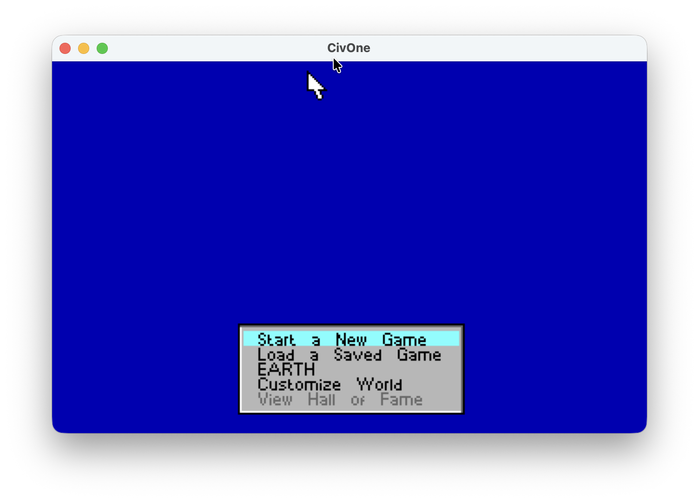
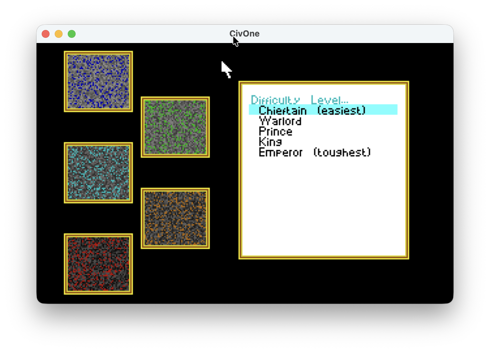
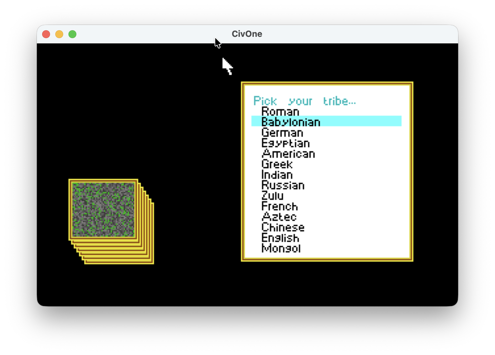
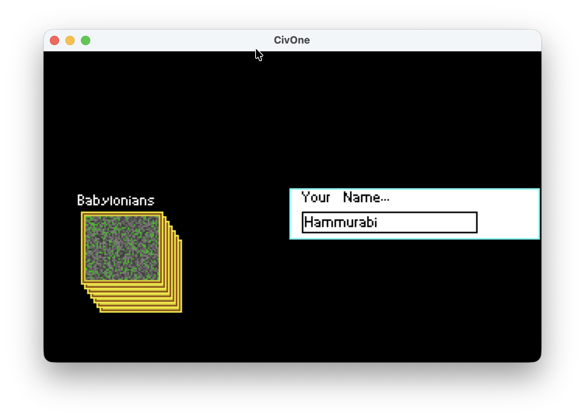
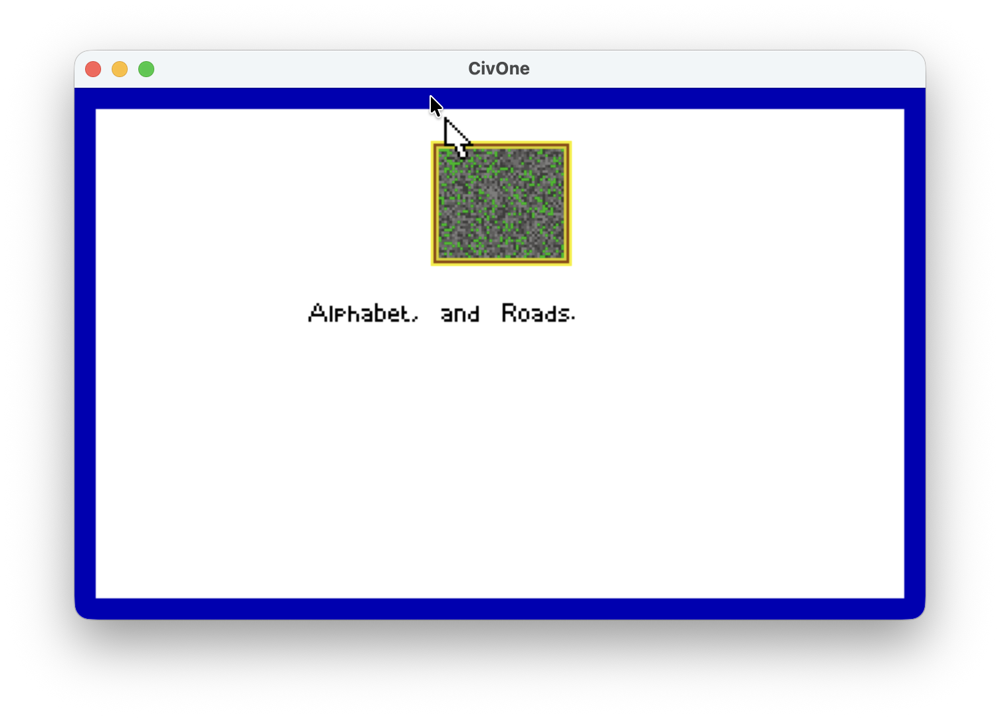
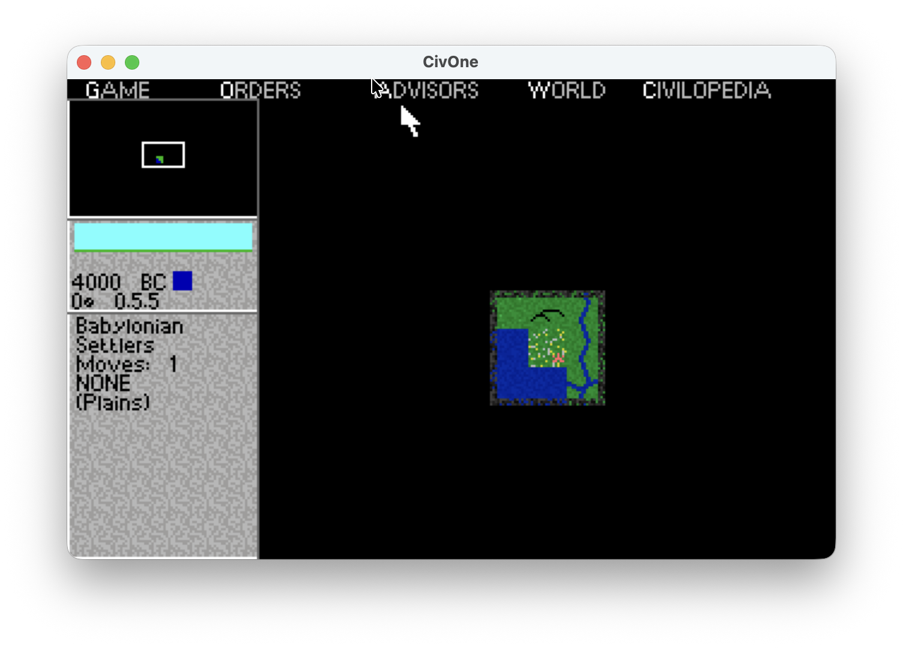
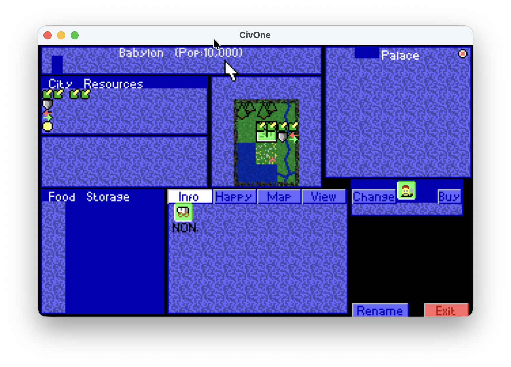

# CivOne

CivOne is an open-source reimplementation of Sid Meier's Civilization with a .NET codebase and an SDL runtime.

This repository is a personal fork of the original CivOne project, adapted for local experimentation and platform compatibility work.

## Fork Notes

This fork is maintained by `VeryOldgammer`.

Recent fork-specific work includes:
- updating the SDL runtime target to `net8.0`
- expanding publish targets for Windows, macOS, and Linux
- improving the macOS folder picker implementation
- adding a helper script for multi-platform runtime publishing

## Attribution

Original CivOne project by `SWY1985` and contributors:
- Upstream repository: <https://github.com/Solen1985/CivOne>

This fork keeps the original project credit intact while maintaining its own changes separately.

## Project Structure

- `src/` - core game logic
- `runtime/sdl/` - desktop runtime based on SDL
- `api/` - plugin and extension API
- `resources/` - platform-specific assets and packaging files
- `scripts/` - helper scripts for local build and publish workflows

## Publishing

To publish the SDL runtime for supported desktop platforms:

```bash
./scripts/publish-runtime.sh
```

Published files are written to `artifacts/publish/`.

## Screenshots

### Main Menu


### Difficulty Selection


### Civilization Selection


### Player Name


### Starting Technologies


### Early Game Map


### City Screen


## License

See [LICENSE.md](LICENSE.md).
